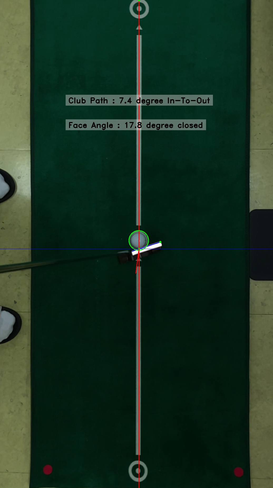

# face_angle_club_path
To find face angle and club path of a putting video input
Change input video file to use in the main function
+ Constraints
+ + Put reflective marker on the top of the putter
+ + Use slow motion camera and lower the f-number

